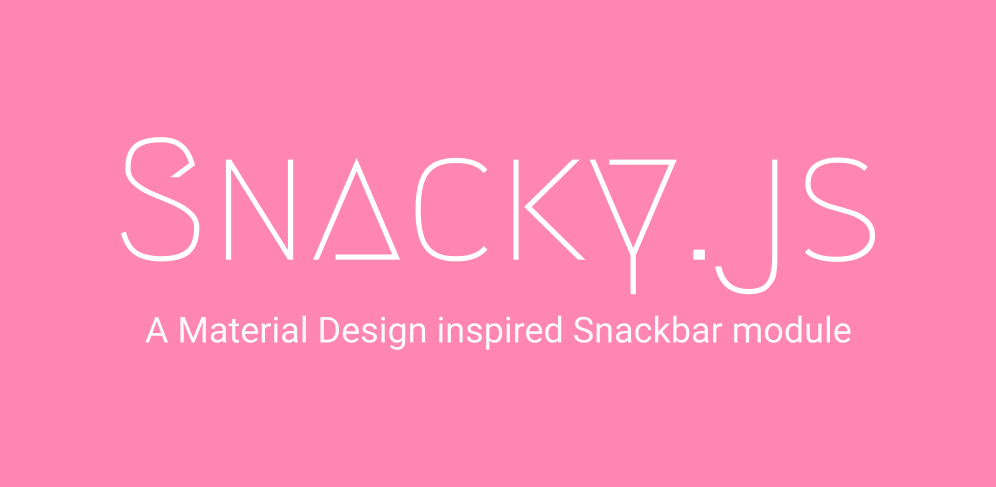

[](https://github.com/collinsnji/Snacky)

[](https://travis-ci.org/collinsnji/Snacky)
[](https://coveralls.io/github/collinsnji/Snacky?branch=master)
[]()
[]()
[]()
[]()
[]()
[](https://collingrimm.me/LICENSE.txt)

## A Material Design inspired Snackbar plugin for the web

**Snacky.js** is a simple and minimal node module which makes adding snackbar notifications to web apps utterly easy.

### How to install

In your project root, run  

`npm install --save snacky.js`

### How to use

Require the module like any other module in your javascript file. That is,

`var Snacky = require('snacky.js')`

### Example usage
<script src='/dist/snacky.min.js'></script>   
<script>
  function showExample(){
    new Snacky().show('Simple snackbar example');
  }
</script>

<button onclick='showExample()'>Show Example</button>   

```javascript
  var Snacky = require('snacky.js');

  // Create a new default Snacky notification (or snackbar)
  // Default message in snackbar is 'Snacky is awesome!'
  let snackbar = new Snacky();

  // Show the default snackbar
  snackbar.show();
```
### Want Snacky.js to blend with your app style?

__Change default message__
```javascript
  var Snacky = require('snacky.js');

  // Create a new Snacky notification with custom content
  let snackbar = new Snacky('Hello world');
      snackbar.show();
  // Tip: You can create and show a snackbar at the same time. E.g
  // let snackbar = new Snacky('Hello world').show();
```
__Change default style and timeout duration__
```javascript
  var Snacky = require('snacky.js');

  // Change text color and background color
  let snackbar = new Snacky('Hello world', {color: 'red', background: '#43528f'});
  // Color value follows the same convention as in CSS

  // Change default duration
  let snacky = new Snacky('Hello world', {duration: 6000}).show();
  // The duration parameter is in miliseconds
```
__Want to customise more__
```javascript
  var Snacky = require('snacky.js');

  // Combine it all
  let Snack = new Snacky('Unicorns can\' fly!', {
      color: '#fff', background: 'pink', duration: '4000'
    });
  // Add an action button!
  new Snacky('Action button', { showAction: true, actionText: 'OK'}).show();
```
#### All properties

| Property     | Type    | Default               | Desription                                 |
| ------------ | ------- | --------------------- | ------------------------------------------ |
| `message`    | string  | Snacky.js is awesome! | Notification message                       |
| `color`      | string  | #FFFFFF               | Color of notification text                 |
| `background` | string  | #323232               | Notification background color              |
| `duration`   | integer | 5000                  | Timeout before notification is destroyed   |
| `showAction` | boolean | false                 | Show an action button on the notification  |
| `actionText` | string  | Dismiss               | Text to show on notification action button |

### Contributing

Want to contribute to make this better? Open a new issue or add a new feature then make a PR :)

### License
Licensed under the [MIT License](https://collingrimm.me/LICENSE.txt)
